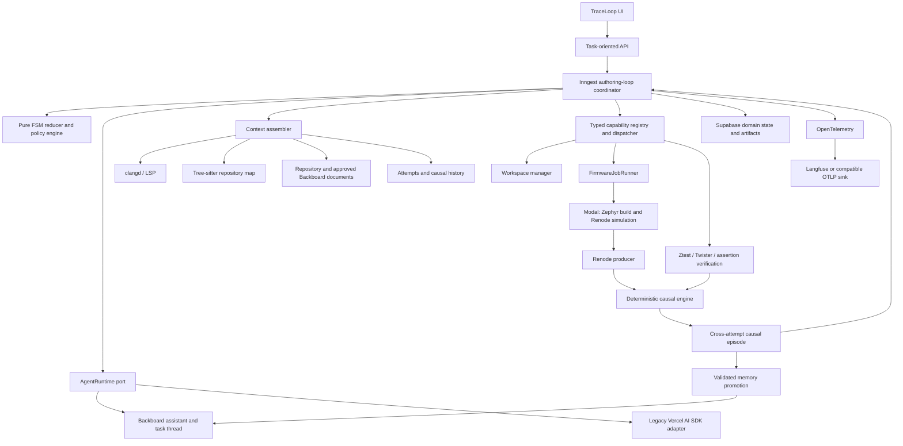

# Spec: Industry-aligned agentic architecture with Backboard conversation management

Status: ready-for-agent

Date: 2026-07-18

## Purpose

Build TraceLoop into a durable, one-request agentic firmware IDE that can interpret an objective, resolve ambiguity, plan, author Zephyr firmware, build, simulate in Renode, test, identify a root cause through the causal engine, patch, and rerun until it reaches a truthful terminal condition.

This plan adopts the common architecture used by mature agentic IDEs—intent compilation, planning, context engineering, code intelligence, isolated execution, verification, memory, observability, and human oversight—without replacing TraceLoop's differentiating domain core with a generic agent framework.

Backboard is the managed conversational and semantic-memory substrate. It is not the workflow engine, task database, source store, policy engine, or causal authority.

## Relationship to existing plans and decisions

This is the umbrella implementation spec for the agentic architecture. It incorporates and expands the Backboard-specific design in `docs/agents/backboard-agent-runtime-implementation.md`.

The following remain authoritative prerequisites and are not superseded:

- `docs/productization/blocking-fixes-plan.md` remains authoritative for the current P0/P1 correctness and integrity work. Production adoption in this spec must not begin on top of a pipeline that still duplicates or bypasses the tested authoring loop.
- `docs/productization/implementation-plan.md` remains the productization plan where it does not overlap the blocking-fixes plan.
- ADR-0001 through ADR-0005 remain in force.
- ADR-0006's rule that the model serves the FSM remains in force. A new ADR may supersede only its provider/runtime selection after the Backboard feasibility gate passes.
- ADR-0007 remains in force: use validated search/replace operations; do not adopt Aider, SWE-agent, OpenHands, LangGraph, or another coding-agent harness as the orchestrator.

If this spec conflicts with the Backboard implementer brief on sequencing or system-wide architecture, this spec is authoritative. The brief remains the detailed reference for the Backboard slice and should be aligned during issue 02.

## Outcome

A user can submit one objective and TraceLoop will:

1. Compile the request into a versioned, executable `TaskContract`.
2. Resolve discoverable ambiguity from project and substrate context.
3. Ask the minimum blocking clarification questions on the same Backboard thread.
4. Produce and validate a plan and test strategy.
5. Create an isolated, immutable attempt workspace.
6. Retrieve firmware-aware code context using LSP, syntax, dependency, Git, and causal signals.
7. Propose and apply only authorized source changes.
8. Build and simulate in the existing Modal compute plane.
9. Verify behavior with Zephyr-native tests and Renode assertions.
10. Use the causal engine to identify the root cause and compare attempts.
11. Continue with a materially revised intervention, pause, or terminate truthfully.
12. Promote only validated conclusions or explicit approved decisions to Backboard memory.

The authoring loop terminates only when:

- Every acceptance criterion passes.
- Required user input or approval is outstanding.
- A resource or permission limit is reached.
- The user cancels the task.
- The evidence is inconclusive and no safe diagnostic action remains.
- The progress assessor demonstrates repeated no-progress behavior.

"One request" means the loop proceeds without unnecessary handoffs after its contract is executable. It does not mean guessing about behavior-defining, safety-relevant, or irreversible requirements.

## Current-state gap analysis

| Industry layer | Current TraceLoop state | Required change |
| --- | --- | --- |
| Intent understanding | Plain intent plus text clarification | Compile a versioned `TaskContract` with structured ambiguities, assumptions, criteria, budgets, and permissions |
| Planner/task manager | Basic file/action list | Dependency-aware plan with tests, evidence expectations, allowed scope, risk, and replanning rules |
| Context engine | Broad source concatenation | Stage-specific retrieval, token budgets, provenance, recency, and relevance scoring |
| Code intelligence | Text/file operations | clangd/LSP symbols and diagnostics, Tree-sitter repo map, Zephyr compilation database, optional read-only Serena tools |
| Conversation | No complete durable conversational layer | One Backboard thread per task, authenticated conversation proxy, external references in Supabase |
| Working memory | Mutable task fields and transient prompts | Contract, attempt, plan, activity, causal episode, and continuation records |
| Semantic memory | No controlled cross-task recall | Explicit validated promotion to project-scoped Backboard memory with a local synchronization ledger |
| Tool layer | State-specific calls and partial Zod schemas | Canonical capability registry, generated JSON Schema, dispatcher, state/permission/idempotency checks |
| Workspace | Mutable `tasks.currentFiles` | Immutable attempt snapshots plus isolated Git/Modal working copies and reproducible diffs |
| Execution | Inngest and Modal exist, with overlapping loop implementations | One pure coordinator/reducer and one durable production path |
| Verification | Build, Renode trace, deterministic analyzer | Zephyr Ztest/Twister scenarios, protected criteria, structured verification matrix |
| Causal feedback | Root cause for a run | Cross-attempt causal episodes, failure signatures, intervention outcomes, diagnosis deltas |
| Observability/evals | Operational logs and tests | OpenTelemetry traces, model/tool metrics, Langfuse experiments, regression datasets, security evals |
| External interoperability | MCP and Git are incomplete | Internal capability seam first; stable MCP adapter and Git provider adapters later |
| Security | Permission and validation primitives exist | Full agent threat model, least privilege, prompt/context isolation, memory poisoning controls, retention/deletion |

## Architectural principles

1. **The model proposes; TraceLoop disposes.** Model output never directly changes state, source, tests, permissions, budgets, or memory.
2. **The FSM is authoritative.** A pure reducer validates every transition; Backboard does not select arbitrary stages.
3. **One durable coordinator.** Inngest owns long-running orchestration, retries, waits, cancellation, and timeouts.
4. **One source snapshot per attempt.** Every build, trace, diagnosis, and patch is attributable to immutable source input.
5. **Conversation is not execution state.** Backboard explains the dialogue; Supabase and artifacts prove what happened.
6. **Memory is not history.** Failed work remains episodic evidence but is not promoted as a reusable fact.
7. **Causality is evidence, not a generic knowledge graph.** The causal graph connects observations, root causes, interventions, and outcomes.
8. **Context is assembled, not dumped.** Every prompt receives only stage-relevant, attributable context.
9. **Tools are capabilities, not shell access.** Expose domain verbs with bounded schemas and policy checks.
10. **Retries are expected.** Every external call and mutation has an idempotency key and reconciliation path.
11. **Autonomy changes approvals, not safety.** Autonomous mode still obeys scope, validation, budgets, isolation, and audit requirements.
12. **Portability is designed in.** Backboard, observability sinks, code-intelligence providers, compute runners, and MCP are behind ports.

## Target architecture



## Ownership map

| Concern | Authority | Projection/integration |
| --- | --- | --- |
| User goal and lifecycle | TraceLoop task | Backboard thread metadata |
| Conversation history | Backboard task thread | Authenticated TraceLoop conversation API; optional completion archive |
| Project conversational profile | Backboard project assistant | TraceLoop project runtime binding |
| Task contract and revisions | Supabase | Selected revision summarized to Backboard |
| FSM and continuation | Supabase plus pure reducer | Status messages in Backboard/UI |
| Activities and approvals | Supabase | Backboard tool-call/message references |
| Source and tests | Immutable attempt snapshot/artifact or Git reference | Ephemeral isolated workspace |
| Build/simulation | Inngest coordination and Modal job | Progress in UI/Backboard |
| Acceptance result | TraceLoop verifier | Summary in conversation |
| Root cause and causal chain | TraceLoop causal engine | Narrative generated through runtime |
| Working context | Backboard thread plus TraceLoop attempt/context packet | No hidden-reasoning persistence |
| Project semantic memory | Backboard assistant, controlled by TraceLoop policy | Local synchronization/provenance ledger |
| Stable project documents | Repository/TraceLoop storage | Versioned Backboard document index |
| Model choice | TraceLoop stage policy | Backboard model access or legacy AI SDK |
| Tool contracts | Canonical Zod schemas | Generated Backboard JSON Schema and MCP schemas |
| Agent telemetry | OpenTelemetry | Langfuse initially; OTLP-compatible alternative allowed |

## Backboard integration model

### Scope

- One Backboard assistant per TraceLoop project.
- One Backboard thread per TraceLoop task.
- The assistant carries versioned system instructions, approved tools, document-index configuration, and project-safe semantic memory.
- The task thread carries the full user/assistant/tool conversation for that task.
- Existing tasks remain pinned to the runtime with which they began.

### Provider facts to verify in the feasibility spike

As of 2026-07-18, official Backboard documentation describes:

- Threads as persistent ordered conversations containing user, assistant, and tool messages.
- Each thread belonging to exactly one assistant.
- Assistant-level memory and documents being shared across the assistant's threads.
- Tool calls returning `REQUIRES_ACTION`; arguments arrive as serialized JSON; all parallel tool outputs must be submitted together; more tool rounds may follow.
- Memory modes `Auto`, `Readonly`, and `off`, with explicit add/search/update/delete operations and asynchronous operation status.
- Documents with assistant or thread scope and asynchronous indexing states.
- In-progress run cancellation that becomes effective on a provider yield.

Do not depend on these details until issue 01 records live behavior, identifiers, failure modes, limits, and reconciliation options.

### Conversation persistence policy

- Do not introduce a second live local transcript table while Backboard is the selected runtime.
- Store `assistantId`, `threadId`, last reconciled external message/run IDs, runtime version, and activity references locally.
- Every user-visible side effect remains represented by a local activity even though the conversational request lives remotely.
- Fetch conversation through the authenticated backend after ownership checks; never expose the Backboard API key.
- If portability or compliance requires an archive, export a sanitized, immutable completion artifact. The archive is not a second mutable conversation store.
- Conversation unavailability must not corrupt the confirmed contract, attempt, source, run, or causal evidence. Work that needs a new model turn waits or uses an explicitly allowed fallback; already-dispatched deterministic work may finish.

### Long-running work

Do not hold a Backboard tool call open while Modal builds or simulates.

```text
Backboard requests a bounded domain action
  -> TraceLoop validates and claims an activity
  -> TraceLoop returns accepted/queued with activityId
  -> Inngest dispatches and waits durably
  -> Modal completes the firmware job
  -> TraceLoop verifies and records evidence
  -> a later message on the same thread supplies the result
  -> Backboard continues the next conversational turn
```

Cancellation addresses both the active Backboard run and the durable Inngest/Modal work. Cancellation is idempotent, and late results may not overwrite a stopped task.

## Domain contracts

### TaskContract

The natural-language request is never the executable plan. It is compiled into a versioned contract:

```ts
interface TaskContract {
  schemaVersion: number;
  taskId: string;
  revision: number;
  objective: string;
  substrate: "zephyr";
  board: {
    id: string;
    buildTarget: string;
    revision?: string;
  };
  constraints: Array<{
    id: string;
    description: string;
    source: "user" | "project" | "board" | "policy";
  }>;
  acceptanceCriteria: AcceptanceCriterion[];
  testStrategy: TestStrategy;
  assumptions: Assumption[];
  ambiguities: Ambiguity[];
  permissionProfile: "review" | "guided" | "autonomous";
  budgets: {
    maxAttempts: number;
    maxElapsedMs: number;
    maxCostUsd: number;
    maxModelTurns: number;
    maxToolCalls: number;
  };
  allowedPaths?: string[];
  protectedPaths: string[];
  terminalPolicy: TerminalPolicy;
  status: "draft" | "confirmed" | "superseded";
  sourceMessageIds: string[];
}
```

Acceptance criteria must be executable. A criterion identifies the observable, expectation, timing or sequencing bound, applicable scenario, and evidence producer. An empty criterion set can never pass.

Once confirmed, an attempt pins a contract revision. A user change that affects expected behavior, board selection, tests, permissions, or budgets creates a new revision and deterministically invalidates incompatible plans and attempts.

### Structured ambiguity

```ts
interface Ambiguity {
  id: string;
  field: string;
  question: string;
  reason: string;
  classification:
    | "discoverable"
    | "bounded-assumption"
    | "blocking"
    | "evidence";
  options?: Array<{
    value: unknown;
    consequence: string;
  }>;
  recommendedDefault?: unknown;
  resolution?: unknown;
  sourceRefs: string[];
}
```

Resolution policy:

| Classification | Behavior |
| --- | --- |
| Discoverable | Inspect the repository, board metadata, devicetree, Kconfig, approved documents, or prior validated evidence before asking the user |
| Bounded assumption | Use an explicit reversible default only when the permission profile and policy allow it; record it in the contract and UI |
| Blocking | Transition to `clarification-needed`, state why guessing matters, ask the minimum grouped question, and wait |
| Evidence | Run a bounded diagnostic/instrumentation step; if comparable evidence still cannot be produced, return `inconclusive` and ask or block |

Questions should normally present two or three concrete options and a recommended choice. The answer produces contract revision N+1; it does not directly authorize source or test mutation.

Mid-loop ambiguity must be resumable. The task stores a continuation cursor containing the prior state, activity, attempt, and pinned contract revision. Active states that may discover ambiguity can transition to `clarification-needed`; after resolution the coordinator resumes from the earliest invalidated checkpoint rather than restarting blindly.

### Plan

The plan is a validated engineering DAG, not prose:

```ts
interface AgentPlan {
  schemaVersion: number;
  contractRevisionId: string;
  steps: Array<{
    id: string;
    kind: "inspect" | "test" | "edit" | "build" | "simulate" | "verify";
    dependsOn: string[];
    paths: string[];
    description: string;
    evidenceExpected: string[];
    permission: string;
  }>;
  risks: string[];
  summary: string;
}
```

The model proposes the DAG; TraceLoop validates dependency closure, step kinds, path scope, permissions, and mandatory verification. Build/simulate ordering remains owned by the coordinator.

### Attempt and workspace

An attempt spans planning/editing through verification, not only the firmware run.

```ts
interface Attempt {
  id: string;
  taskId: string;
  sequence: number;
  parentAttemptId?: string;
  contractRevisionId: string;
  planId?: string;
  baseSourceRef: string;
  workspaceRef: string;
  sourceSnapshotRef?: string;
  diffArtifactRef?: string;
  status:
    | "preparing"
    | "editing"
    | "running"
    | "evaluating"
    | "passed"
    | "failed"
    | "inconclusive"
    | "cancelled";
}
```

`tasks.currentFiles` may remain as a compatibility projection during migration, but it is not the long-term source of truth.

Workspace rules:

- Create an isolated working copy for each attempt.
- Persist the immutable source snapshot before build dispatch.
- Link every run to its attempt and source snapshot.
- Use Git worktrees when a repository is connected or local execution is used.
- Use content-addressed artifacts for uploaded/generated projects without Git.
- Use Modal filesystem snapshots for expensive environment state where beneficial, not as the only authoritative source record.
- Make workspace creation, snapshot, diff, discard, and cleanup available through a `WorkspaceManager` port.
- Never allow an agent tool to escape its workspace root.

### Activity

Every meaningful request and side effect has one idempotent activity:

```ts
interface Activity {
  id: string;
  taskId: string;
  attemptId?: string;
  type: string;
  status:
    | "pending"
    | "running"
    | "awaiting-input"
    | "awaiting-approval"
    | "completed"
    | "failed"
    | "cancelled";
  idempotencyKey: string;
  actor: "user" | "agent" | "system";
  externalProvider?: "backboard" | "inngest" | "modal" | "mcp";
  externalId?: string;
  runId?: string;
  patchId?: string;
  stableErrorClass?: string;
  startedAt?: string;
  completedAt?: string;
}
```

Create or claim the activity before an external call or mutation. A retry returns the prior completed result or resumes reconciliation. Backboard message/tool-call IDs are references, not the activity identity.

### Causal episode and progress

The causal engine remains deterministic for firmware failure analysis. Extend its evidence across attempts:

```ts
interface CausalEpisode {
  id: string;
  taskId: string;
  failedAttemptId: string;
  failedCriterionId: string;
  failureSignature: string;
  rootCauseRef?: string;
  failureKind: "divergence" | "missing-write" | "build" | "infrastructure";
  hypothesis: string;
  interventionPatchId?: string;
  validationAttemptId?: string;
  outcome: "resolved" | "unchanged" | "regressed" | "inconclusive";
  diagnosisDelta: DiagnosisDelta;
  evidenceRefs: string[];
}
```

Outcome classification is deterministic where evidence permits:

- `resolved`: the previously failed criterion passes without a prohibited weakening.
- `unchanged`: the same criterion and root-cause signature remain.
- `regressed`: the original issue remains and another criterion or earlier path worsens.
- `inconclusive`: build, simulation, trace collection, or analysis did not produce comparable evidence.

The progress assessor compares the contract, failing criteria, failure signature, root cause, causal path, source diff, and resource use. It prevents repeating the same intervention without new evidence and stops after the configured no-progress threshold.

## Agent runtime ports

Backboard types do not leak beyond the adapter.

```ts
interface AgentRuntime {
  ensureProjectConversationScope(input: ProjectRuntimeInput): Promise<ProjectRuntimeRef>;
  ensureTaskConversation(input: TaskRuntimeInput): Promise<TaskConversationRef>;
  runStage(input: AgentStageRequest): Promise<AgentStageResponse>;
  submitToolResults(input: ToolResultSubmission): Promise<AgentStageResponse>;
  getConversation(input: ConversationQuery): Promise<ConversationView>;
  cancel(input: RuntimeCancellation): Promise<void>;
}

interface SemanticMemoryStore {
  search(input: MemorySearch): Promise<MemoryResult[]>;
  add(input: ValidatedMemory): Promise<ExternalMemoryRef>;
  update(input: MemoryUpdate): Promise<void>;
  delete(input: MemoryDelete): Promise<void>;
}

interface KnowledgeDocumentIndex {
  synchronize(input: DocumentSyncRequest): Promise<DocumentSyncResult>;
  delete(input: DocumentDeleteRequest): Promise<void>;
}

interface CodeIntelligence {
  repositoryMap(input: RepoMapRequest): Promise<RepoMap>;
  symbols(input: SymbolQuery): Promise<SymbolResult[]>;
  references(input: ReferenceQuery): Promise<ReferenceResult[]>;
  diagnostics(input: DiagnosticsQuery): Promise<Diagnostic[]>;
}
```

Implementations:

- `BackboardAgentRuntime`
- `BackboardSemanticMemoryStore`
- `BackboardKnowledgeDocumentIndex`
- `LegacyAiSdkRuntime`
- `ClangdCodeIntelligence`
- `TreeSitterRepositoryMap`
- optional `SerenaCodeIntelligence` spike, read-only initially

## Context engine and code intelligence

The context assembler builds a stage-specific packet from attributable sources:

```ts
interface AgentContextPacket {
  contract: TaskContract;
  plan?: AgentPlan;
  attempt: AttemptSummary;
  conversationRefs: string[];
  projectRules: ContextDocument[];
  selectedSymbols: SymbolContext[];
  diagnostics: Diagnostic[];
  relevantDiffs: DiffContext[];
  relevantCausalEpisodes: CausalEpisodeSummary[];
  validatedMemories: MemoryContext[];
  tokenBudget: number;
  omissions: Array<{ source: string; reason: string }>;
}
```

Retrieval order:

1. Confirmed task contract and protected acceptance criteria.
2. Current attempt, approved plan, and direct compiler/verifier feedback.
3. Symbols and references implicated by the objective, diagnostics, or root cause.
4. Neighboring build configuration, devicetree, Kconfig, and tests.
5. Relevant project rules and ADRs.
6. Previous causal episodes with matching criteria/signatures.
7. Validated semantic memories.
8. Recent relevant conversational turns.

Requirements:

- Generate or capture the real Zephyr `compile_commands.json` for clangd; do not accept default-host parsing as correct firmware semantics.
- Use LSP for definitions, references, symbols, and diagnostics.
- Use Tree-sitter for fast syntax maps and broken/incomplete source.
- Treat Serena as an accelerator over LSP/MCP, not as the source of truth; disable its shell, memory, and mutation tools during the initial spike.
- Keep embeddings optional until deterministic retrieval baselines and evaluation cases exist.
- Record context source identifiers and omissions for debugging.
- Never upload the changing source tree to Backboard documents after every edit. Synchronize only stable, approved project documents.

## Capability registry and tool gateway

Define capabilities once with canonical Zod schemas. Generate Backboard-compatible JSON Schema and, later, MCP definitions from the same source.

Initial agent-stage capabilities:

- `request_clarification`
- `submit_task_contract`
- `submit_plan`
- `submit_file_operations`
- `submit_patch`
- `report_blocker`

Read-only context capabilities:

- `list_project_files`
- `read_project_files`
- `inspect_board`
- `query_symbols`
- `get_acceptance_criteria`
- `get_previous_attempts`
- `query_causal_history`

Coordinator-owned domain capabilities:

- `snapshot_workspace`
- `dispatch_firmware_run`
- `evaluate_run`
- `promote_memory`

The model does not decide when to call coordinator-owned capabilities. The coordinator invokes them after validated stage output.

Every dispatched tool call performs, in order:

1. Authentication and project ownership.
2. Runtime/task/attempt resolution.
3. FSM-state and stage-to-tool allowlist check.
4. Idempotent activity claim.
5. Zod validation.
6. Permission-profile and approval check.
7. Plan/path/protected-file/traversal/size policy.
8. Domain operation.
9. Artifact and external-reference persistence.
10. Activity completion or stable failure classification.
11. Bounded, redacted tool result submission.

No generic shell, arbitrary filesystem root, raw database, deployment, credential, or unrestricted network capability is exposed to Backboard.

### MCP

MCP is an external interoperability adapter, not the internal architecture.

- Implement the internal capability registry first.
- Use the stable official TypeScript SDK version selected at implementation time; do not build production behavior on a beta protocol without an ADR.
- Expose bounded domain resources/tools after the internal contracts stabilize.
- Require authorization, origin/host validation, scoped credentials, progress/cancellation, and audit linkage for remote transports.
- Keep Inngest as the durable task engine even if MCP task extensions become available.

## Durable authoring-loop coordinator

Use one pure reducer from both unit tests and the Inngest production coordinator. Remove or wrap duplicate transition logic in `src/engine/authoring-loop.ts` and `backend/inngest/functions.ts` so they cannot diverge.

Events:

```text
task/agent.requested
task/agent.continue
task/clarification.resolved
task/approval.resolved
task/run.requested
task/run.finished
task/agent.cancelled
memory/consolidation.requested
```

High-level sequence:

```text
receive objective
  -> ensure Backboard project assistant and task thread
  -> compile draft TaskContract
  -> resolve discoverable ambiguity
  -> wait for blocking clarification when needed
  -> confirm contract revision
  -> create attempt and isolated workspace
  -> assemble firmware-aware context
  -> obtain and validate plan
  -> obtain and validate source operations
  -> apply or wait for approval
  -> snapshot source
  -> dispatch firmware worker
  -> wait for terminal run event
  -> verify all criteria
  -> build causal episode and assess progress
  -> complete, patch, replan, clarify, or block
  -> consolidate validated memory asynchronously
```

Coordinator requirements:

- No long-running HTTP requests.
- Deterministic step IDs include task, attempt, stage, and contract revision.
- Run worker always emits one terminal outcome event, including cancellation and infrastructure failure.
- Approval and clarification are durable waits, not polling loops.
- The meaningful FSM state remains visible while an activity is awaiting approval.
- Cancellation prevents late writes and cancels active provider/compute operations where supported.
- Budget checks occur before every model turn, tool call, source mutation, and firmware dispatch.
- A provider error cannot be mistaken for a firmware failure.
- An inconclusive attempt cannot be marked passed or promoted to semantic memory.

## Verification architecture

Verification is layered:

1. Zod/JSON Schema contract validation.
2. Static firmware validation and protected-test enforcement.
3. clangd compiler-semantic diagnostics.
4. Zephyr build in Modal.
5. Ztest/Twister test scenarios where available.
6. Renode simulation and normalized trace production.
7. Acceptance-criterion evaluation.
8. Deterministic causal analysis for failures.
9. Cross-attempt progress assessment.

Twister should be the scenario/test-matrix layer because it can build and run Zephyr tests across configured boards/emulators and emit machine-readable JSON/JUnit reports. Renode remains the TraceLoop simulation producer for the causal path. Do not weaken approved tests or acceptance criteria to obtain a pass.

Required end-to-end cases:

- First-pass success.
- Initial blocking clarification then success.
- Discoverable ambiguity resolved without asking.
- Build failure repaired.
- Divergence failure repaired from a root cause.
- Missing-write failure repaired using the expected path.
- Ineffective intervention followed by a materially revised intervention.
- Regression detected and rolled back/replanned.
- Inconclusive trace triggers instrumentation rather than a fabricated root cause.
- Review/guided approval pause and resume.
- Autonomous completion within limits.
- Cancellation during Backboard reasoning and Modal compute.
- Provider timeout/retry without duplicated mutation.
- No-progress termination.

## Memory architecture

### Memory types

| Memory type | Location | Lifetime | Use |
| --- | --- | --- | --- |
| Conversation/working memory | Backboard task thread | Task retention period | User/assistant/tool continuity |
| Operational state | Supabase task, attempt, activity, run | Durable/auditable | Resume, permissions, budgets, proof |
| Episodic evidence | Attempts, artifacts, causal episodes | Durable/auditable | Avoid repeated failures and explain progress |
| Project documents | Repository or TraceLoop storage | Versioned | Architecture, substrate rules, approved docs |
| Project semantic memory | Backboard project assistant | Until superseded/deleted | Validated reusable facts and decisions |
| User preferences | TraceLoop user-scoped settings unless isolation is proven | User-controlled | Personal preferences without cross-user leakage |

### Stage policy

| Stage | Backboard memory mode |
| --- | --- |
| Clarification | `Readonly`; explicit preference capture only |
| Contract compilation | `Readonly` |
| Planning | `Readonly` |
| Editing | `Readonly` |
| Raw build/simulation/log transfer | `off` |
| Diagnosis and patching | `Readonly` |
| Consolidation | Explicit add/update/delete |

Do not use broad automatic memory extraction in the authoring loop.

Promotable knowledge:

- An explicit user preference in a safe user scope.
- An approved stable project decision.
- A board/substrate constraint confirmed by authoritative project data.
- A causal conclusion confirmed by a comparable successful validation attempt.
- A failure signature and ineffective intervention, phrased as scoped historical evidence rather than a universal rule.

Never promote:

- Hidden model reasoning.
- Unverified hypotheses or diagnoses.
- Raw logs, traces, source snapshots, secrets, locks, or budgets.
- Current task state.
- Failed patches represented as facts.
- Automatically inferred procedures that have not been reviewed and versioned.

Memory consolidation is asynchronous and non-critical. A task remains successfully completed if Backboard memory synchronization fails. Every external memory has a local synchronization record with scope, source evidence, external ID, status, and supersession/deletion lifecycle. The evidence remains even when the semantic memory is deleted.

## Observability and evaluation

### OpenTelemetry trace model

Use OpenTelemetry as the vendor-neutral instrumentation layer. Pin the semantic-convention version used for GenAI data because those conventions continue to evolve.

```text
task trace
  -> contract/clarification span
  -> attempt span
      -> context retrieval spans
      -> Backboard model turn spans
      -> tool validation/execution spans
      -> workspace snapshot span
      -> Inngest firmware worker span
          -> Modal build span
          -> Renode simulation span
          -> verification span
      -> causal analysis span
      -> progress assessment span
  -> memory consolidation span
```

Correlate:

- task, project, user-safe tenant, contract revision, attempt, run, patch, activity, and causal episode IDs;
- Backboard assistant, thread, message, run, tool-call, document, and memory IDs;
- Inngest function/step and Modal job IDs;
- provider/model, tokens, cost, latency, retry count, outcome, and stable error class.

Do not record secrets, full sensitive source, hidden reasoning, or raw unrestricted prompts by default.

### Evaluation platform

- Emit OTLP and initially use Langfuse for trace inspection, datasets, experiments, and scoring.
- Keep the instrumentation portable so Phoenix or another OTLP-compatible sink can replace it.
- Build a versioned evaluation dataset from synthetic firmware cases, repository fixtures, and sanitized production failures.
- Use deterministic evaluators before LLM-as-judge.
- Add Promptfoo or equivalent red-team/trajectory tests before external autonomous access.

Core metrics:

- Contract completeness and clarification rate.
- Unnecessary-question rate and blocking-ambiguity miss rate.
- Plan/tool schema validity.
- Protected-path/policy violation attempts.
- Build success by attempt.
- Acceptance pass rate and attempts to completion.
- Root-cause comparability and causal outcome classification.
- Repeated intervention/no-progress rate.
- Memory retrieval precision and measured benefit.
- Model/tool/compute cost and latency per completed task.
- Cancellation, recovery, duplicate-side-effect, and inconclusive rates.

No runtime or memory provider becomes default based only on anecdotal demos. Promotion requires measured performance against the evaluation dataset and live operational thresholds.

## Security and trust boundaries

Threat-model the system against the OWASP Agentic Security Initiative categories, including goal manipulation, prompt/context injection, tool misuse, memory poisoning, identity spoofing, excessive agency, resource overload, unexpected code execution, untraceable actions, and human-approval manipulation.

Required controls:

- Server-only Backboard, Supabase service-role, Modal, and model credentials.
- Ownership checks before every project, assistant, thread, document, memory, task, and artifact operation.
- Stage-specific capability allowlists and least privilege.
- Input/source/document size limits and path containment.
- Prompt-injection separation: repository text is untrusted data, never policy.
- Secret scanning/redaction before provider-bound context.
- Protected tests and acceptance criteria.
- Explicit approval summaries showing exact effect, files, tests, cost, and destination.
- Idempotent side-effect ledger and immutable evidence references.
- Network egress restrictions for sandboxes and no host secrets in Modal.
- Per-task model/tool/compute/time budgets.
- Memory provenance, scope isolation, correction, supersession, and deletion.
- Retention/deletion jobs for Backboard threads, assistants, documents, memories, snapshots, and local references.
- No hidden-reasoning persistence.
- Security trajectory evals before enabling external MCP servers or autonomous Git/network actions.

## Persistence changes

Exact migration design belongs to the implementation issues, but the target model includes:

### Projects

- `agentRuntimeDefault`
- `backboardAssistantId`
- `assistantConfigVersion`
- `assistantProvisioningState`

### Tasks

- `agentRuntime`
- `backboardThreadId`
- `activeBackboardRunId`
- `lastBackboardMessageId`
- `activeContractRevisionId`
- `activeAttemptId`
- `continuationState`

### New or expanded records

- `task_contract_revisions`
- `plans` or versioned plan artifacts
- `attempts`
- expanded `activity_logs` with idempotency and external references
- `causal_episodes`
- `memory_sync`
- optional `document_sync`

### Existing records

- Add `attemptId` and source snapshot references to `runs`.
- Add attempt/causal references to `patches`.
- Preserve `iteration` during compatibility migration but derive it from attempt sequence after cutover.
- Treat `tasks.currentFiles` as a compatibility projection until all source consumers use `WorkspaceManager`.

All migrations are forward-compatible, safely backfilled, covered by ownership/RLS policies, and do not require switching existing tasks to Backboard.

## APIs and UI

Provider-neutral API commands:

- `agent.startTask`
- `agent.submitTurn`
- `agent.respondToClarification`
- `agent.approveActivity`
- `agent.rejectActivity`
- `agent.resumeTask`
- `agent.cancelTask`
- `agent.getConversation`
- `agent.getActivityTimeline`
- `agent.getTaskContract`
- `agent.getAttempts`
- `agent.getCausalEpisodes`

Conversation and activity are distinct UI surfaces:

- Conversation: what the user and agent communicated.
- Task contract: what TraceLoop currently understands and will prove.
- Activity: what was requested, authorized, executed, retried, or rejected.
- Attempt: which immutable source state was built and tested.
- Failure analysis: what the causal evidence supports.
- Memory: what was retained for future tasks and why.

The clarification card shows the missing decision, why it matters, options, the recommended default, and the resulting contract diff. The persistent task-attention bar shows state, attempt, permission profile, budget, and required user action.

## Standards and interoperability alignment

| Standard/pattern | TraceLoop use |
| --- | --- |
| Explicit state machine and durable workflow | Pure reducer plus Inngest checkpoints/events |
| JSON Schema | Generated external tool contracts from canonical Zod definitions |
| Model Context Protocol | External tool/resource adapter after internal capabilities stabilize |
| Language Server Protocol | clangd-based symbols, references, and diagnostics |
| Tree-sitter | Incremental syntax/repository maps and broken-source parsing |
| Git worktrees/content-addressed artifacts | Isolated, reproducible attempt workspaces |
| OpenTelemetry and W3C trace context | Cross-provider task/attempt/stage correlation |
| Zephyr Ztest/Twister | Firmware-native unit/integration/scenario verification |
| OWASP Agentic Security guidance | Threat modeling and pre-release security controls |
| Least privilege and zero-trust tool execution | Per-stage capability allowlists, sandboxing, auth, and audit |

These are interoperability boundaries, not reasons to move domain decisions out of TraceLoop.

## Implementation sequence

### External gate: current correctness baseline

Complete or explicitly re-verify the applicable ready issues under `.scratch/productization/`, especially the single Modal contract, real production authoring loop, permission enforcement, cancellation, idempotency/budgets, LLM validation, Modal hardening, and shipped-path integration tests.

The Backboard feasibility spike may run in parallel. Production runtime migration may not.

### Phase 0 — Feasibility and baseline

- Issue 01: verify Backboard behavior and write the go/no-go report.
- Re-run the current typecheck/test baseline and record known failures.
- Freeze representative authoring-loop fixtures and latency/cost baselines.

Exit: Backboard tool dialogue, thread recovery, memory isolation, cancellation, identifiers, usage, and reconciliation have an acceptable implementation path. Otherwise retain the legacy AI SDK runtime and use Backboard only for the subset that passed.

### Phase 1 — Architecture seams and executable intent

- Issue 02: managed-runtime ADR, ports, feature flags, legacy adapter.
- Issue 03: versioned `TaskContract`, ambiguity compiler, clarification continuation.
- Issue 04: idempotent activities and external references.

Exit: legacy behavior still works through ports; a task cannot enter planning without a confirmed executable contract; retries cannot duplicate observable side effects.

### Phase 2 — Reproducible work and context intelligence

- Issue 05: attempts and `WorkspaceManager`.
- Issue 06: Backboard assistant/thread provisioning and reconciliation.
- Issue 07: context assembler, clangd, Tree-sitter, optional read-only Serena spike.

Exit: every model stage and firmware run is tied to a contract and immutable attempt; context retrieval is symbol-aware and attributable; one assistant/thread mapping survives retries.

### Phase 3 — Typed tools and Backboard conversation stages

- Issue 08: canonical capability registry, JSON Schema generation, dispatcher.
- Issue 09: Backboard conversational stage service, tool loop, model policy, cancellation.

Exit: invalid, unauthorized, out-of-state, duplicate, malformed, or out-of-scope calls cannot mutate source; Backboard can conduct clarification/planning/editing/patching turns on the same thread.

### Phase 4 — One-shot durable authoring loop

- Issue 10: single Inngest coordinator and pure reducer integration.
- Integrate immutable attempts, durable waits, approvals, clarification, cancellation, budgets, and terminal outcome events.

Exit: one request can complete, pause, resume, or block without a long-lived HTTP request and without duplicated mutations/runs.

### Phase 5 — Causal iteration and controlled memory

- Issue 11: cross-attempt causal episodes and progress assessor.
- Issue 12: explicit Backboard memory consolidation and lifecycle.

Exit: TraceLoop can prove whether an intervention resolved, repeated, regressed, or failed to produce comparable evidence; every active memory is scoped and traceable to validated evidence or an explicit approved source.

### Phase 6 — Product API, interoperability, and evaluation

- Issue 13: conversation/activity/contract/attempt APIs and UI.
- Issue 14: stable MCP adapter over the capability registry.
- Issue 15: OpenTelemetry, Langfuse datasets/experiments, agent metrics.
- Issue 16: security, retention/deletion, and Promptfoo/red-team suite.

Exit: users can distinguish conversation from execution and evidence; operators can reconstruct a task; external tools are scoped; agent/security regressions are gated in CI.

### Phase 7 — Staged rollout

- Issue 17: end-to-end qualification, shadow comparison, canary rollout, rollback, and legacy removal criteria.

Rollout order:

1. Internal live feasibility resources only.
2. Backboard shadow planning with no shadow side effects.
3. Selected new internal tasks use the full Backboard runtime.
4. Limited percentage of new external tasks.
5. Backboard becomes default for new tasks after thresholds hold.
6. Legacy adapter removal only after at least two stable release cycles or a separately approved evidence-based threshold.

Never switch an in-progress task between runtimes without a designed migration preserving thread, activity, contract, and attempt continuity.

## Ticket map

| Issue | Title | Primary dependency |
| --- | --- | --- |
| 01 | Backboard feasibility and contract spike | None; may run beside productization fixes |
| 02 | Managed-runtime ADR, ports, and feature flags | 01 |
| 03 | Executable TaskContract and ambiguity lifecycle | 02 |
| 04 | Idempotent activity ledger and external reconciliation | 02 |
| 05 | Immutable attempts and workspace manager | 02, 04 |
| 06 | Backboard assistant/thread provisioning | 01, 02, 04 |
| 07 | Firmware-aware context and code intelligence | 02, 05 |
| 08 | Typed capability registry and safe dispatcher | 03, 04, 07 |
| 09 | Backboard conversation stage service | 06, 08 |
| 10 | Durable one-shot authoring-loop coordinator | 05, 08, 09 plus productization gate |
| 11 | Cross-attempt causal progress assessment | 10 |
| 12 | Controlled semantic-memory consolidation | 06, 11 |
| 13 | Conversation/activity/contract UI and APIs | 03, 09, 10, 12 |
| 14 | MCP interoperability adapter | 08, 10 |
| 15 | Agent observability and evaluation datasets | 04, 09, 10, 11 |
| 16 | Security, retention, deletion, and red teaming | 08, 12, 14, 15 |
| 17 | End-to-end qualification and staged rollout | 13, 15, 16 |

## Test strategy

Every issue follows TDD at the narrowest useful public boundary:

1. Characterize existing behavior that must remain stable.
2. Add a failing behavior-level test.
3. Implement the minimum change.
4. Run the narrow test, affected integration tests, typecheck, and repository suite.
5. Refactor only after green.

Test layers:

- Pure reducer, policy, ambiguity, progress, and memory-classification unit tests.
- Shared valid/invalid corpus against Zod and generated JSON Schema.
- Adapter contract tests using fake Backboard HTTP responses.
- Opt-in live Backboard tests with isolated assistants/threads/documents/memories and deterministic cleanup.
- Inngest coordinator tests with event/wait/retry/cancellation behavior.
- Workspace containment and snapshot reproducibility tests.
- clangd/Tree-sitter fixture tests with Zephyr compilation commands.
- Modal contract tests and opt-in build/simulation integration.
- Causal engine and cross-attempt outcome fixtures.
- tRPC ownership, RLS, and API contract tests.
- Playwright tests for clarification, approval, stop/takeover, conversation/activity separation, and resume.
- Evaluation and red-team suites in CI with deterministic gates first.

Do not claim provider behavior from mocks alone. Live tests are opt-in but required before each rollout promotion.

## Release gates

### Gate A — Feasibility

- Backboard structured tool calls meet the acceptance threshold.
- Required external identifiers exist or a safe reconciliation strategy is proven.
- Memory/document/thread isolation and deletion are verified.
- Fallback scope is documented.

### Gate B — Domain safety

- FSM, permission, idempotency, budget, path, protected-test, and cancellation suites pass.
- No model or Backboard call can directly mutate authoritative state.
- Every run references an immutable source snapshot.

### Gate C — Agent quality

- Evaluation suite shows no regression versus the legacy runtime on success, attempts, cost, or latency beyond approved tolerances.
- Blocking ambiguity misses and unnecessary questions are below configured thresholds.
- No-progress and inconclusive cases terminate truthfully.

### Gate D — Security and operations

- OWASP-aligned threat model reviewed.
- Promptfoo/trajectory red-team suite passes required policies.
- Retention, deletion, incident reconciliation, and rollback are exercised.
- Operators can trace task -> attempt -> activity -> provider -> run -> causal episode without hidden reasoning.

### Gate E — Default runtime

- Internal and canary release metrics meet thresholds for the configured period.
- No unresolved data-isolation, duplication, or cancellation incidents.
- The legacy adapter remains usable for rollback.

## Completion criteria

The effort is complete only when:

- A new task can execute the complete authoring loop from one initial request.
- Clarification can occur initially or mid-loop and resume on the same Backboard thread from the correct checkpoint.
- A confirmed task contract and protected executable criteria govern every attempt.
- The FSM and Inngest remain the only authorities for transitions and durable orchestration.
- Backboard owns conversation continuity without owning task truth or source mutation.
- Every side effect is idempotent and attributable to an activity.
- Every run is tied to an immutable attempt/source snapshot.
- Code context is firmware-aware and no longer depends on concatenating the repository.
- Verification includes substrate-native tests, Renode evidence, and deterministic causal analysis.
- Causal episodes prevent blind repetition and explain progress across attempts.
- Semantic memories are explicitly promoted, scoped, traceable, correctable, and deletable.
- OpenTelemetry traces and evaluation datasets support regression decisions.
- External MCP capabilities are scoped, authenticated, and backed by the same internal contracts.
- Existing tasks remain on their original runtime.
- Backboard can be disabled without losing authoritative domain, source, run, artifact, or causal state.
- Type checking, deterministic tests, affected integration tests, security gates, and required live provider checks pass.

## Explicit deferrals

- Generic multi-agent delegation. Prove the single-agent loop first.
- Graph database adoption for agent provenance. Use relational/structured causal episodes until scale proves otherwise.
- Uploading the live source tree to Backboard documents.
- Embedding-first code search before LSP/syntax baselines are evaluated.
- Aider/SWE-agent/OpenHands as orchestrator. A contained diff-producing editor tool remains an evidence-based escape hatch.
- E2B or Daytona while Modal satisfies the firmware compute requirement.
- Automatic procedure learning from conversations.
- Unrestricted external MCP marketplaces or generic shell tools.
- Legacy-runtime removal before the rollout gate.

## Source references

- Backboard architecture: <https://docs.backboard.io/concepts/architecture>
- Backboard threads: <https://docs.backboard.io/concepts/threads>
- Backboard messages: <https://docs.backboard.io/concepts/messages>
- Backboard tool calling: <https://docs.backboard.io/concepts/tool-calling>
- Backboard memory: <https://docs.backboard.io/concepts/memory>
- Backboard documents: <https://docs.backboard.io/concepts/documents>
- Backboard models: <https://docs.backboard.io/concepts/models>
- MCP SDKs: <https://modelcontextprotocol.io/docs/sdk>
- Language Server Protocol: <https://microsoft.github.io/language-server-protocol/>
- clangd compilation commands: <https://clangd.llvm.org/design/compile-commands>
- Tree-sitter: <https://tree-sitter.github.io/tree-sitter/>
- Zephyr Twister: <https://docs.zephyrproject.org/latest/develop/test/twister.html>
- OpenTelemetry: <https://opentelemetry.io/docs/>
- OWASP Agentic Security Initiative: <https://genai.owasp.org/initiatives/agentic-security-initiative/>

## Implementer handoff format

At the end of each issue, report:

1. The externally observable behavior added or changed.
2. The architectural boundary affected.
3. Files, migrations, feature flags, and provider resources changed.
4. Tests and commands run, separating mocks from live verification.
5. Any Backboard assistant/thread/document/memory created and its cleanup status.
6. Unresolved provider behavior, risk, or ADR conflict.
7. Deployment, migration, retention, and rollback implications.
8. The next unblocked issue.
