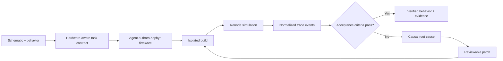
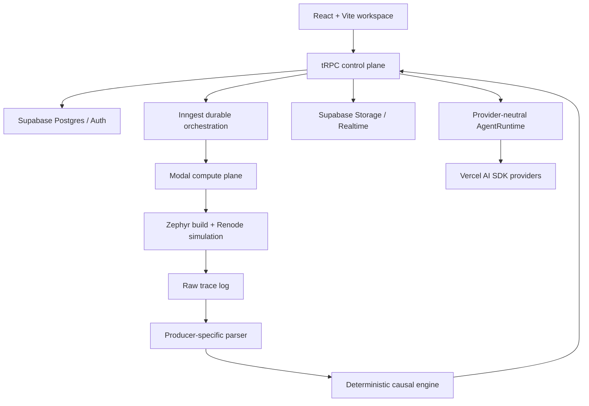

# TraceLoop

**Turn a hardware design into verified firmware before you reach the lab.**

TraceLoop is a schematic-first, agentic firmware workspace. It helps an engineer describe a behavior, author Zephyr firmware, build and run it in an isolated Renode simulation, and trace a failed assertion back to the hardware event that caused it.

[Try the staged demo](https://traceloop-hackathon-demo.tsgoswam.chatgpt.site/?demo=1) · [Read the product flow](docs/user-interaction-flow.md) · [Explore the architecture decisions](docs/adr/)

> [!WARNING]
> TraceLoop is an active pre-release prototype. The deterministic demo and core engine are useful today, but product wiring, release coverage, and operational hardening are still in progress. Do not treat the current repository as production- or safety-critical-ready.

## Why TraceLoop?

Firmware failures are rarely explained by a compiler error alone. A timer may fire, an interrupt may run, and the firmware may still write the wrong register or never perform the expected write at all. Traditional logs tell you what happened; they do not reliably connect the failed requirement to its causal hardware path.

TraceLoop closes that gap with one bounded authoring loop:

```text
intent → acceptance criteria → firmware → build → simulate → analyze → patch → rerun
```

The goal is not to replace engineering judgment. It is to make every generated change reviewable and every claim of success traceable to evidence.

## Product loop



### What makes it different

- **Hardware-aware input** — the task begins from a target board or schematic, not a generic coding prompt.
- **Evidence-backed completion** — a build is not considered success; the requested behavior must be observed in simulation.
- **Causal failure analysis** — the engine identifies the first contradictory event, or the last event on the expected path when a write is missing.
- **Bounded agent autonomy** — review, guided, and autonomous profiles sit behind explicit state transitions, permissions, iteration limits, time limits, and cost budgets.
- **Reviewable interventions** — proposed changes are tied to trace evidence and rerun against unchanged acceptance criteria.
- **Replaceable infrastructure** — producers emit one normalized trace format, compute runs behind a job interface, and model access sits behind a provider-neutral runtime port.

## Current status

TraceLoop has a working demonstration path and substantial implementation across the control plane, compute plane, causal engine, and frontend. The public-release milestone is still in progress; the repository's productization plans record the hardening already delivered and the remaining gaps in the live user path.

| Area                      | Status                             | Notes                                                                                                              |
| ------------------------- | ---------------------------------- | ------------------------------------------------------------------------------------------------------------------ |
| Schematic-first workspace | In active development              | Parsing and platform derivation exist; the live upload-to-workspace path is the next major product integration.    |
| Causal engine             | Implemented and tested             | Consumes normalized `TraceEvent[]` data and supports divergence and missing-write failures.                        |
| Zephyr + Renode path      | Implemented                        | The reference firmware targets `stm32f4_disco` and runs in Renode.                                                 |
| Backend and data model    | Implemented                        | tRPC, Supabase, Drizzle, storage, realtime, health checks, and audit records are present.                          |
| Durable execution         | Implemented and integration-tested | Inngest orchestrates work and Modal isolates and authenticates the firmware toolchain.                             |
| Agentic authoring loop    | Core implemented                   | FSM, permissions, validated edits, cancellation, budgets, patch approvals, and rerun coverage are present.         |
| Additional boards         | Foundation present                 | Board capability modeling exists; broader verified board coverage remains roadmap work.                            |
| Public release            | In progress                        | Live frontend integrations, deployment automation, community health files, and broader end-to-end coverage remain. |

The first supported firmware substrate is **C + Zephyr** on the **STM32F4 Discovery** reference target. The demo uses a simulation overlay for its GPIO mapping; see [ADR-0002](docs/adr/0002-zephyr-firmware-substrate.md) for the rationale.

## Quick start

### 1. Explore the deterministic UI demo

This is the fastest way to understand the product without provisioning cloud services.

#### Prerequisites

- Node.js 18 or newer
- npm

#### Run it

```bash
git clone https://github.com/Hostileoracle0606/TraceLoop.git
cd TraceLoop
npm --prefix frontend ci
npm --prefix frontend run dev
```

Open [http://127.0.0.1:5173/?demo=1](http://127.0.0.1:5173/?demo=1). The route bypasses authentication and opens the clearly labeled read-only samples. Explore the Timer LED failure or Vehicle Gateway project, and switch between **Chat** and **Sample canvas** to inspect the evidence.

### 2. Run the full development stack

The live path adds authenticated persistence, durable orchestration, isolated firmware builds, simulation, and an LLM provider.

#### Additional prerequisites

- A [Supabase](https://supabase.com/) project for Postgres, Auth, Storage, and Realtime
- An [Inngest](https://www.inngest.com/) account or local Dev Server
- A [Modal](https://modal.com/) account and CLI
- An Anthropic or OpenAI API key
- Python 3.12+ for the current Modal image/tooling path

#### Configure and start

```bash
cp .env.example .env
npm ci
npm --prefix frontend ci

# Provision the development schema.
npm run db:push

# Deploy the isolated Zephyr + Renode compute endpoint.
modal deploy modal/app.py

# Terminal 1: tRPC API and Inngest endpoint.
npm run backend:dev

# Terminal 2: React application.
npm --prefix frontend run dev
```

Add the deployed Modal endpoint and service credentials to `.env`, and run the Inngest Dev Server against `/api/inngest`. The complete environment-variable reference and deployment sequence live in the [migration guide](MIGRATION.md) and [deployment guide](docs/release/deployment.md).

> [!CAUTION]
> Never expose `SUPABASE_SERVICE_KEY`, LLM API keys, or Inngest credentials to the frontend. Keep secrets in local environment files or the deployment platform's secret store.

## Configuration

The backend validates environment variables at startup. Start from [`.env.example`](.env.example); the main groups are:

| Group                    | Variables                                                         | Required for                                                  |
| ------------------------ | ----------------------------------------------------------------- | ------------------------------------------------------------- |
| Supabase                 | `SUPABASE_URL`, `SUPABASE_ANON_KEY`, `SUPABASE_SERVICE_KEY`       | Auth, database access, storage, and realtime                  |
| Database                 | `DATABASE_URL`                                                    | Drizzle migrations and persistence                            |
| Compute                  | `MODAL_ENDPOINT`                                                  | Real firmware build and simulation                            |
| Orchestration            | `INNGEST_EVENT_KEY`, `INNGEST_BASE_URL`                           | Durable pipeline execution                                    |
| Model runtime            | `LLM_PROVIDER` and either `ANTHROPIC_API_KEY` or `OPENAI_API_KEY` | Planning, editing, clarification, and patch generation        |
| Optional managed runtime | `BACKBOARD_API_KEY`, `AGENT_RUNTIME_BACKBOARD_ENABLED`            | Opt-in Backboard feasibility path; not the production default |
| Observability            | `LOG_LEVEL`, `SENTRY_DSN`                                         | Structured logs and error reporting                           |
| Server                   | `PORT`, `NODE_ENV`                                                | Runtime behavior                                              |

## Architecture

TraceLoop keeps authoritative state, untrusted compute, deterministic analysis, and model behavior behind separate boundaries.



### Boundary rules

1. **The FSM owns state transitions.** The LLM serves a state; it does not choose the workflow.
2. **The compute plane only builds and simulates.** Causal analysis stays in the control plane.
3. **The engine only consumes normalized events.** Renode, fixtures, and future producers meet the same `TraceEvent[]` contract.
4. **Approved tests stay authoritative.** A repair must not silently weaken the acceptance criteria that exposed the failure.
5. **Completion requires evidence.** Compile success alone is never the completion contract.

## Repository layout

| Path                   | Purpose                                                                                          |
| ---------------------- | ------------------------------------------------------------------------------------------------ |
| `src/engine/`          | Deterministic trace analysis, authoring-loop logic, permissions, and run view models             |
| `src/platform/`        | Platform-facing models and fixtures                                                              |
| `backend/`             | tRPC API, database access, Inngest pipeline, model runtime, storage, realtime, and observability |
| `frontend/`            | React/Vite application, Monaco editor, trace views, and Playwright tests                         |
| `firmware-zephyr/`     | Zephyr reference firmware and devicetree overlay                                                 |
| `renode/`              | Renode scripts used by the firmware simulation path                                              |
| `modal/`               | Isolated build-and-simulate compute service                                                      |
| `supabase/`            | Database migrations and Supabase configuration                                                   |
| `docs/adr/`            | Architectural decision records                                                                   |
| `docs/productization/` | Sequenced release-hardening plans                                                                |
| `docs/release/`        | Milestones and deployment guidance                                                               |
| `.scratch/`            | Repository-local specs and issue records                                                         |

## Common commands

| Command                              | What it does                                 |
| ------------------------------------ | -------------------------------------------- |
| `npm test`                           | Runs causal-engine and backend Vitest suites |
| `npm run test:watch`                 | Runs engine tests in watch mode              |
| `npm run test:backend`               | Runs backend tests only                      |
| `npm run typecheck`                  | Type-checks the root TypeScript project      |
| `npm --prefix frontend run build`    | Builds the frontend for production           |
| `npm --prefix frontend run test:e2e` | Runs Playwright end-to-end tests             |
| `npm run backend:dev`                | Starts the backend in watch mode             |
| `npm run db:generate`                | Generates a Drizzle migration                |
| `npm run db:migrate`                 | Applies committed migrations                 |
| `npm run db:studio`                  | Opens Drizzle Studio                         |
| `modal deploy modal/app.py`          | Deploys the isolated firmware compute plane  |

## Roadmap

Roadmap items describe direction, not committed dates. The detailed sources of truth are the [release milestones](docs/release/milestones.md), [blocking-fixes plan](docs/productization/blocking-fixes-plan.md), and [implementation plan](docs/productization/implementation-plan.md).

### Foundation delivered

- [x] Producer-agnostic causal engine
- [x] Real Zephyr build and Renode trace path
- [x] Isolated Modal compute interface
- [x] tRPC + Supabase persistence and authentication foundation
- [x] Inngest pipeline and realtime progress infrastructure
- [x] Explicit agent FSM, permission profiles, audit records, and resource controls
- [x] Idempotent execution, real cancellation, atomic patch approval, and multi-criterion evaluation
- [x] Schema- and policy-validated model edits
- [x] Authenticated, path-contained, resource-capped Modal boundary
- [x] Committed database migrations, board seed, and shipped-path integration tests
- [x] Provider-neutral model-runtime seam with a Vercel AI SDK default
- [x] Truthful React workspace with health-derived status, progressive failure disclosure, and disabled unavailable actions

### Public-release priorities

- [ ] **Wire schematic to workspace** — connect local schematic parsing and platform derivation to project creation, generated criteria, firmware authoring, and the executable canvas.
- [ ] **Finish the remaining product integrations** — connect live build logs, the full trace viewer, context search, task navigation, Git actions, attachments, and agent-mode controls.
- [ ] **Prove the complete user journey** — extend Playwright coverage from the truthful sample workspace through create → build → diagnose → approve → rerun against clean, live-service environments.
- [ ] **Automate release confidence** — add CI gates for type-checking, tests, frontend builds, dependency auditing, migrations, and deploy previews.
- [ ] **Close community-health gaps** — add an explicit license, dedicated contribution guide, code of conduct, security policy, and support channel before calling the project open source.
- [ ] **Operationalize deployments** — document and rehearse secrets, backups, migration rollout, observability, incident recovery, and compute-service limits.
- [ ] **Improve frontend delivery** — split the current large production bundle and continue accessibility, mobile, empty-state, and failure-recovery work.

### Later

- [ ] Verify additional boards and board-specific capability contracts
- [ ] Expand schematic parsing and hardware-model coverage
- [ ] Improve multi-file editing behind the existing sandboxed tool boundary
- [ ] Add multi-tenant workspace features
- [ ] Persist evidence reports and connect publication workflows

## Documentation

- [Domain language](CONTEXT.md) — the terms used consistently across the product and codebase
- [Intended user interaction flow](docs/user-interaction-flow.md) — the full user journey and completion contract
- [Architecture decisions](docs/adr/) — why the system uses Zephyr, normalized traces, Modal, Inngest, and provider-neutral model ports
- [Migration guide](MIGRATION.md) — setup, environment variables, database schema, and API overview
- [Deployment guide](docs/release/deployment.md) — frontend, backend, Modal, database, and observability deployment
- [Release milestones](docs/release/milestones.md) — milestone history and current public-release work
- [Changelog](CHANGELOG.md) — notable changes by release

## Contributing

Contributions are welcome while the public-release work is in progress. Please keep changes focused and make the evidence for them easy to review.

1. Read [CONTEXT.md](CONTEXT.md) and the ADRs related to your change.
2. For substantial work, create or update a local spec under `.scratch/<feature>/`; see the [local issue-tracker conventions](docs/agents/issue-tracker.md).
3. Create a focused branch and avoid mixing unrelated changes.
4. Add or update tests before changing behavior where practical.
5. Run the relevant checks from the [common commands](#common-commands) table.
6. Update documentation when behavior, configuration, architecture, or roadmap status changes.
7. Open a pull request that explains the change, its user impact, and the validation performed.

For questions about an active contribution, use its pull-request conversation. Maintainer planning and issue records intentionally live in the repository under `.scratch/` rather than an external tracker.

## Security and responsible use

- Treat generated firmware and patches as untrusted until they are reviewed and verified.
- Keep service-role keys and provider credentials out of commits, browser bundles, screenshots, and logs.
- Do not expose the current prototype to untrusted multi-tenant workloads.
- Do not use TraceLoop as the sole verification method for production or safety-critical firmware.
- Reproduce a passing simulation on the real target and with the project's normal hardware-validation process before release.

## License

This repository does not currently include an open-source license. Source availability alone does not grant permission to use, modify, or redistribute the project. A license is a public-release roadmap item; until one is added, all rights are reserved by the repository owner.

## Maintainer

TraceLoop is maintained by [Hostileoracle0606](https://github.com/Hostileoracle0606).
